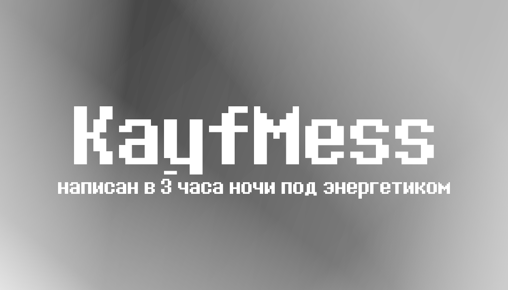

  

<h1 align="center">KayfMess</h1>

  
  

<h3 align="center">САМЫЙ ЛУЧШИЙ МЕСЕНДЖЕР В МИРЕ</h3>

## Шо у нас есть:
- Опенсурсный проект  
- Сам месенджер с дб которая точно никуда не утечет   
- Разрабы которые нихрена не работают  
- Авторизация, которая работает (наверное)  
- Сообщения... иногда даже доходят  
- Интерфейс, на который не больно смотреть (если смотреть в темноте)  
- Баги, фичи, баги-фичи и фичи-баги  

<em>Сам прожект на разработке поэтому типа пон кек</em>

---

### Планы на будущее:
- [ ] Сделать чтобы оно не падало  
- [ ] Нормальный UI (в теории)  
- [ ] Встроенный режим кайфа  
- [ ] Пуш-уведомления для самых отчаянных  
- [ ] Меньше костылей (нет)  

---

### Лицензия
Сам прожект распространяется по [GNU GPLv3](LICENSE).  
По-настоящему энергетичный мессенджер.

---

## Star History

